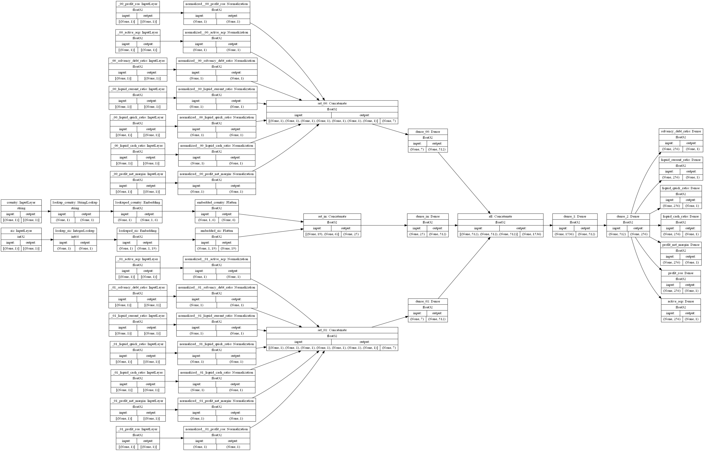

<!--  -->

### Objective.
We want to be able:
1. To get a client's insight (General Financial Health Score) related to his current financial state.
2. To get a prediction regarding the client's financial wellness's changing at nearest three month.
3. Potentially to get a probability prediction of a future the client's default.

### Solution \ Approach.
We will use the public open [Financial Statement Data Sets](https://www.sec.gov/dera/data/financial-statement-data-sets.html)
 from U.S. Securities & Exchange Commission.\
We will use the 10-K and 10-Q financial statement item to calculate the set of Key Financial Ratios.
We should use the Key Financial Ratios to make similar basis of data comparable across all companies.

---
### Key Financial Ratios.
##### Solvency Ratios:
    ** Debt ratio                   = Total Liabilities / Total Assets
    Debt-to-equity ratio            = Total Liabilities / Shareholders Equity
    Interest coverage ratio (ICR)   = EBIT / Interest expenses

##### Liquidity Ratios:
    ** Current ratio   = Current Assets / Current Liabilities
    ** Quick ratio     = (Current Assets – Inventories) / Current Liabilities
    ** Cash ratio      = Cash & Cash Equivalents / Current Liabilities

##### Profitability Ratios:
    ** Net Profit margin                = Net Income after tax / Revenue
    ROE (Return on equity)              = Net Income after tax / Shareholder's Equity
    ** ROA (Return on assets)           = Net Income after tax / Total Assets (or Average Total Assets)
    Gross margin                        = Gross profit / Revenue
    Operating margin (Return on sales)  = EBIT / Revenue

##### Activity Ratios:
    Days inventory outstanding or Inventory turnover, days
                                = (Average Inventory / Cost of Sales) * NUM_DAYS
    ** Average collection period or Receivables turnover, days
                                = (Average Accounts Receivables / Revenue) * NUM_DAYS

** _these coefficients are exploited in the model._

### Formulas based on SEC data.
    formula for EBIT = IS[IncomeLossFromContinuingOperationsBeforeIncomeTaxes] + IS[InterestExpense]
##### Solvency Ratios:
    Debt ratio                      = BS[Liabilities] / BS[Assets]
    Debt-to-equity ratio            = BS[Liabilities] / BS[StockholdersEquity]
    Interest coverage ratio (ICR)   = EBIT/ IS[InterestExpense]

##### Liquidity Ratios:
    Current ratio = BS[AssetsCurrent] / BS[LiabilitiesCurrent]
    Quick ratio   = (BS[CashAndCashEquivalents] + BS[ShortTermInvestments] + BS[AccountsReceivableNetCurrent])
                        / BS[LiabilitiesCurrent]
    Cash ratio    = (BS[CashAndCashEquivalents] + BS[ShortTermInvestments])
                        / BS[LiabilitiesCurrent]

##### Profitability Ratios:
    Gross profit margin                 = IS[GrossProfit] / IS[RevenueFromContractWithCustomer]
    Net profit margin                   = IS[NetIncomeLoss] / IS[RevenueFromContractWithCustomer]
    Operating margin (Return on sales)  = EBIT / IS[RevenueFromContractWithCustomer]
    ROE (net profit version)            = IS[NetIncomeLoss] * (365/NUM_DAYS)
                                            / ((BS[b][StockholdersEquity] + BS[e][StockholdersEquity])/2)
    ROA (net profit version)            = IS[NetIncomeLoss] * (365/NUM_DAYS)
                                            / ((BS[b][Assets] + BS[e][Assets])/2)

##### Activity Ratios:
    Days inventory outstanding or Inventory turnover, days
        = ((BS[b][InventoryNet] + BS[e][InventoryNet])/2)
            / F2[CostOfGoodsAndServicesSold] * NUM_DAYS
    Average collection period or Receivables turnover, days
        = ((BS[b][AccountsReceivableNetCurrent] + BS[e][AccountsReceivableNetCurrent])/2)
            / IS[RevenueFromContractWithCustomer] * NUM_DAYS

###### where:
> **BS** – [Statement of financial position (IFRS, Balance Sheet)](https://www.readyratios.com/reference/accounting/statement_of_financial_position.html)\
> **IS** – [Statement of comprehensive income (IFRS, Income Statement (P&L))](https://www.readyratios.com/reference/accounting/statement_of_comprehensive_income.html)\
> **BS[b]**, **BS[e]** - Statement of financial position (at the [b]egining and at the [e]nd of the analysed period)\
> EBIT = IS[IncomeLossFromContinuingOperationsBeforeIncomeTaxesMinorityInterestAndIncomeLossFromEquityMethodInvestments]+ IS[InterestExpense]\
> **NUM_DAYS** – Number of days in the the analysed period\
> **365** – Days in year\
>Here is a [example of BS and IS](https://www.readyratios.com/reports/MSFT_microsoft-corp?type=quarterly)

---
### Data preprocessing.
 1. We calculate [Top 5 Financial Ratios](https://www.readyratios.com/reference/analysis/most_important_financial_ratios.html) + 1 Activity ratio (Average collection period) for each company.
2. Using SIC ([Standard Industrial Classification](https://www.sec.gov/corpfin/division-of-corporation-finance-standard-industrial-classification-sic-code-list)) from the SEC,
we make a companies' grouping via sectors and calculate the median level for each of 6th ratios.
3. For each company-ratio pair we label it as a "
good" (1) in case the ratio more or equal than related median,  and "bad" (0) if less. Due this way we get common view about company's financial health at to its sector. Something like this.
4. We summarize all the labels and get some total label of "goodness" through all 6 ratios.
5. Like at point 2, with SIC we group total and calculate average (not median).
6. Like at point 3, for each company we calculate a label of total financial health. More or equal than average from p.5 - "
good", less - "bad".
Now we have the processed development data set for modeling General FH Score. See above.

Finally the data set contains about 51K ratios \ 3.5K companies \ 375 sectors.

---
### Model.
To get an estimation for a current financial wellness we use a XGBoost model.
We exploited a 5-fold Cross-Validation with Bayesian optimization algorithm on 80% of the development dataset to find out the optimal model's parameters and had been estimating the model's performance on rested 20% hold-out test dataset.

#### The model performance:

    
    

    
    

#### Model's prediction explanation:
With the SHAP module it's possible to derive an explanation for a particular prediction,

    
    

or to get its presentation in comperisson with others.

#### Model's interface:
A simplest interface could be done with the [Gradio](https://www.gradio.app/).

---
### Financial health through the coefficients' changing in time.
1. We use the Key Financial Ratios have been calculated on stage #1 and organize them into a time-line from the three-periods ratios' sets.
2. The last (third) period will be used as a "future" for the previous two periods.
2. Comparing the "future" with the "current" and "past" two periods, we can to estimate and to label the changing (improvement or deterioration) for each company-ratio pair in "future".
3. We will try to predict a probability of improvement separatly for each financila ratio.
4. It wiil give us a more clear picture for each client's financial aspect.

##### Solvency Ratios:
    Debt ratio:                         ↑ = deterioration   ↓ = improvement
    Debt-to-equity ratio:               ↑ = deterioration   ↓ = improvement
    Interest coverage ratio (ICR):      ↑ = improvement     ↓ = deterioration

##### Liquidity Ratios:
    Current ratio:                      ↑ = improvement     ↓ = deterioration
    Quick ratio:                        ↑ = improvement     ↓ = deterioration
    Cash Ratio:                         ↑ = improvement     ↓ = deterioration

##### Profitability Ratios:
    Net Profit margin:                  ↑ = improvement     ↓ = deterioration
    ROE (Return on equity):             ↑ = improvement     ↓ = deterioration
    ROA (Return on assets):             ↑ = improvement     ↓ = deterioration
    Gross margin:                       ↑ = improvement     ↓ = deterioration
    Operating margin (Return on sales): ↑ = improvement     ↓ = deterioration

##### Activity Ratios:
    Days inventory outstanding, days:   ↑ = deterioration   ↓ = improvement
    Average collection period, days:    ↑ = deterioration   ↓ = improvement

To tackle this chalenge we could harness a deep learning model with multi-inputs \ multi-outputs architecture.

